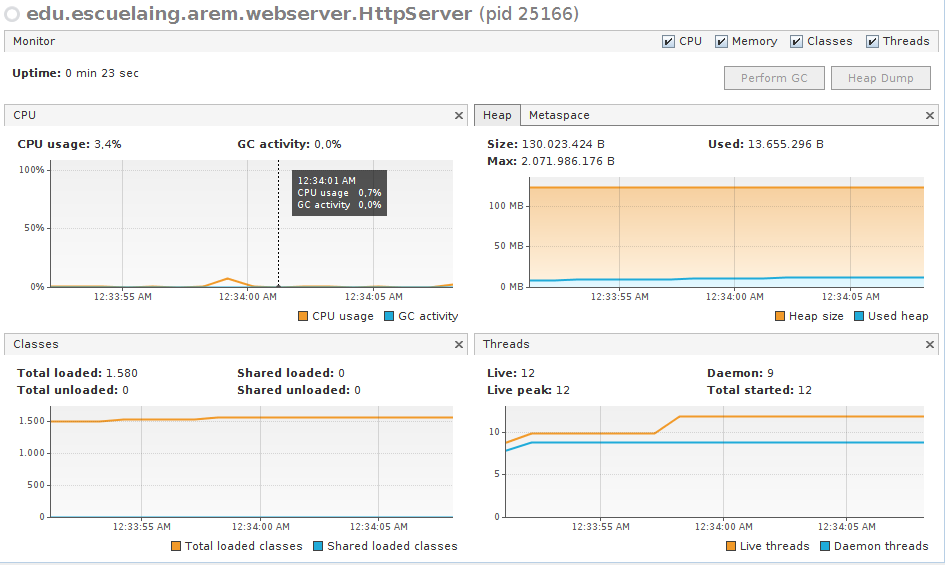

# Escuela Colombiana de Ingeniería Julio Garavito
## Arquitecturas empresariales
### Jonathan Prieto
#### Taller 4 - Introducción a AWS
#### [Link Heroku borrado, desplegar localmente]()
#### [Link Artículo e Informe](https://docs.google.com/document/d/1nfSWHyAGxBy--t2lWpMvRuNdGOBypKsZEYj-L7iWyk8/edit?usp=sharing)
---
##### Enunciado
Se debe construir lo siguiente:

1. [x] Crear una máquina virtual de Linux en AWS.

2. [x] Desplegar un cliente que lea URLs e imprima contenidos en consola, en la máquina virtual de AWS.

3. [x] Conectar el cliente desplegado a una aplicación Web desplegada en Heroku. usando el servidor Web que desarrolló

4. [x] Modifique su servidor Web para que responda múltiples peticiones de manera concurrente.

5. [x] Modifique su cliente para probar su servidor web haciendo muchas peticiones en paralelo.

6. [x] Mida el desempeño de su servidor web variando el número de hilos que soporta y aumentando o disminuyendo el número de peticiones concurrentes.

7. [x] Mejore su servidor para soportar aplicaciones WEB Java. Use el patrón de inversión de control.

- En la raíz del repositorio se podrá encontrar el artículo y los diagramas en astah que componen la arquitectura del taller. Dentro del artículo se encuentra el informe sobre el cliente en AWS.
